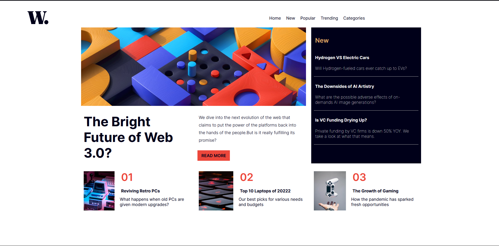

# Frontend Mentor - News homepage solution

### The challenge

Users should be able to:
- See hover and focus states for all interactive elements on the page

### Screenshot

### Links

- Solution URL: https://www.frontendmentor.io/profile/Chinwenmeri/solutions
- Live Site URL: https://news-home-page-ochre.vercel.app/

## My process

### Built with

- Semantic HTML5 markup
- CSS custom properties
- Flexbox
- CSS Grid

### What I learned

In carrying ouy this project, I worked extensively to undersand how flexboxes work. I learnt about flexes and Grid layout and how these work individually and together to create amazing pages. 

Also in implementing the core html structure I learnt how to better arrange elements to achieve certain looks and feels. 

## Author
- Frontend Mentor - [@Chinwenmeri](https://www.frontendmentor.io/profile/Chinwenmeri)
- Twitter - [@Chinwenmeri3](https://x.com/Chinwenmeri3)

